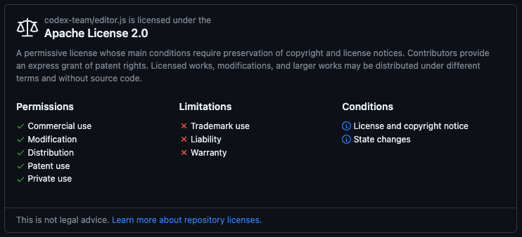

# DevEditor
DevContainer + VUE + Editor.JS

### Editor.JS
> - [Home Page](https://editorjs.io/)
> - [GitHub](https://github.com/codex-team/editor.js)

</img>

### YouTube Link

###### 1. DevEditor 알아보기 [EditorJS]

###### 2. DevEditor 사용해보기 [EditorJS Vue]

